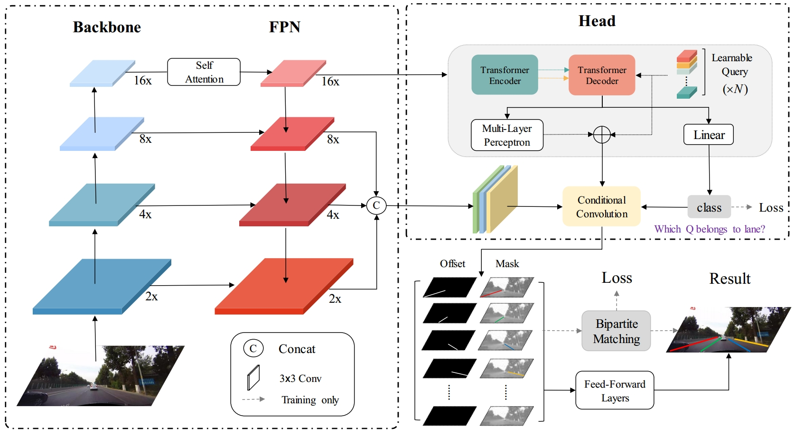

# Transformer Generates Conditional Convolution Kernels For End-to-End Lane Detection
This is the official implementation code of the paper "Transformer Generates Conditional Convolution Kernels For End-to-End Lane Detection"

Statement: This code is based on CondLaneNet.(Link: [https://arxiv.org/abs/2105.05003](https://arxiv.org/abs/2105.05003))



## Installation


This implementation is based on mmdetection(v2.0.0). Please refer to [install.md](docs/install.md) for installation.


## Datasets
We conducted experiments on CurveLanes, CULane and TuSimple. Please refer to [dataset.md](dataset.md) for installation. 


## Testing
**CurveLanes**
1 Edit the "data_root" in the config file to your Curvelanes dataset path. 
For example, for the small version, open "configs/curvelanes/curvelanes_small_test.py" and 
set "data_root" to "[your-data-path]/curvelanes".

2 run the test script

``` bash
cd [project-root]
python tools/condlanenet/curvelanes/test_curvelanes.py configs/condlanenet/curvelanes/curvelanes_small_test.py [model-path] --evaluate
```
If "--evaluate" is added, the evaluation results will be printed.
If you want to save the visualization results, you can add "--show" and add "--show_dst" to specify the save path.

**CULane**

1 Edit the "data_root" in the config file to your CULane dataset path. 
For example,for the small version, you should open "configs/culane/culane_small_test.py" and 
set the "data_root" to "[your-data-path]/culane".

2 run the test script

``` bash
cd [project-root]
python tools/condlanenet/culane/test_culane.py configs/condlanenet/culane/culane_small_test.py [model-path]
```

- you can add "--show" and add "--show_dst" to specify the save path.
- you can add "--results_dst" to specify the result saving path.

3 We use the official evaluation tools of [SCNN](https://github.com/XingangPan/SCNN) to evaluate the results. 

**TuSimple**

1 Edit the "data_root" in the config file to your TuSimple dataset path. 
For example,for the small version, you should open "configs/tusimple/tusimple_small_test.py" and 
set the "data_root" to "[your-data-path]/tuSimple".

2 run the test script

``` bash
cd [project-root]
python tools/condlanenet/tusimple/test_tusimple.py configs/condlanenet/tusimple/tusimple_small_test.py [model-path]
```

- you can add "--show" and add "--show_dst" to specify the save path.
- you can add "--results_dst" to specify the result saving path.

3 We use the official evaluation tools of [TuSimple](https://github.com/TuSimple/tusimple-benchmark) to evaluate the results. 

**Speed Test**

``` bash
cd [project-root]
python tools/condlanenet/speed_test.py configs/condlanenet/culane/culane_small_test.py [model-path]
```


## Training

For example, train CULane using 4 gpus:

``` bash
cd [project-root]
CUDA_VISIBLE_DEVICES=0,1,2,3 PORT=29001 tools/dist_train.sh configs/condlanenet/culane/culane_small_train.py 4 --no-validate 
```

## Citation
If you find this article very helpful in your research, or if you wish to have a reference when using our results, please cite the following papers: